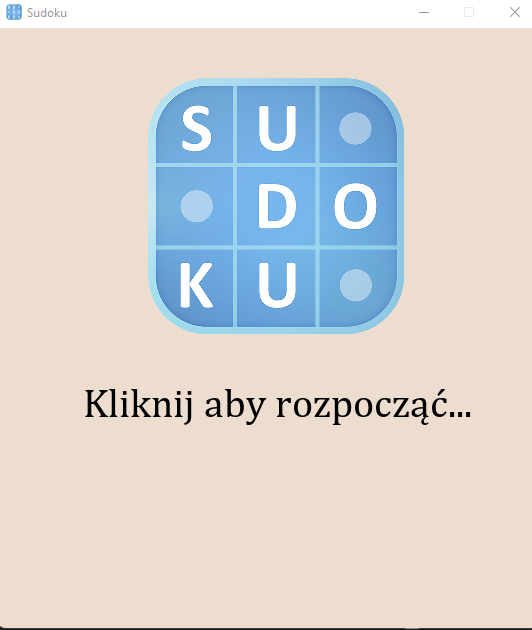
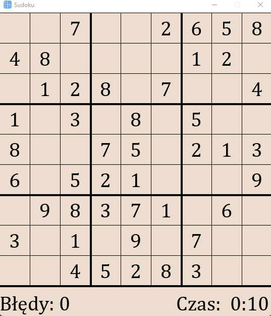

# **Sudoku Game**
<br>
<div style="text-align: right"><b>Wojciech Matuszewski</b></div>

## **1. Opis programu**
Program oferuje możliwość samodzielnego rozwiązania zagadki Sudoku lub jej automatycznego rozwiązania. <br>
Zasady rozwiązywania Sudoku: <br>
Gra polega na wypełnieniu planszy cyframi od 1 do 9 w ten sposób, aby w tym samym wierszu, w tej samej kolumnie, oraz w każdym sektorze 3×3 oznaczonym pogrubiona linią, znajdowała się tylko jedna taka sama cyfra. Innymi słowy w żadnej kolumnie, wierszu, lub oznaczonym sektorze nie może powtórzyć się dwa razy ta sama cyfra.<br>

Dokładne informacje na temat można znaleźć na stronie: https://pl.wikipedia.org/wiki/Sudoku

----------
<br>

## **2. Opis interfejsu**
Program składa się z ekranu startowego oraz właściwego ekranu wyświetlającego sudoku. <br>
Ekran startowy wyświetla logo programu, po kliknięciu w dowolne miejsce w oknie program przechodzi do wyświetlania sudoku.<br>

Ekran startowy:<br>


<br>
Ekran sudoku pozwala poprzez kliknięcie w dowolny kwadrat sudoku oznaczyć go a następnie 
wpisać dowolna cyfre od 1 do 9 za pomocą klawiatury lub klawiatury numerycznej. Ekran wyświetla również czas od rozpoczęcia rozwiazywania aż do jego zakończenia oraz liczbę błędów popełnionych w trakcie.<br>

Ekran Sudoku: <br>


----------
<br>

## **3. Implementacja**
Tworzenie okna, obsługa jego eventów oraz wyświetlanie klatek zostało
zaimplementowane przy użyciu biblioteki [PyGame](https://www.pygame.org/news).<br><br>
Aplikacja jest podzielona klasy, każda zajmująca się
odpowiednimi funkcjonalnościami:<br>
`Square` - zajmuje się obsługą poszczególnych kwadratów 9x9 w siatce sudoku (wartosciami w odpowiednich komórkach, zaznaczaniem kolorami podczas automatycznego rozwiazywania, podświetlaniem propozycji wpisywanych przez gracza)<br>
`Grid` - zajmuje się obsługą planszy oraz rysowaniem jej na ekranie, wyświetlaniem wartosci na ekran oraz wpisywaniem wartości do komórek,<br>

Funkcja `generate` jest odpowiedzialna za generowanie zagadki sudoku i zapisanie jej w tablicy. <br><br>

```py
def generate():
    '''
    Funkcja generuje tablicę sudoku, zapisuje ją w tablicy,
    natępnie zmienia jej format na 9x9
    '''

    arr = np.array(list(str(generators.random_sudoku(avg_rank=50))))
    arr = arr.reshape(9, 9).astype(np.int64).tolist()

    return arr
```
<br>

Funkcja `main` jest punktem uruchamiania programu oraz obsługi eventów okna.<br><br>

Funkcja `find_empty` znajduje puste miejsce w tablicy. <br><br>

```py
def find_empty(board):
    '''
    Znajduje puste miejsce w tablicy sudoku
    board: częściowo wypełniona tablica
    zwraca: pozycje w tablicy, krotkę (rząd, kolumna),
    jeżeli nie znajdzie pustego miejsca zwraca Nulla
    '''

    for i in range(len(board)):

        for j in range(len(board[0])):

            if board[i][j] == 0:

                return (i, j)
            '''
                (rząd, kolumna)
            '''

    return None
```
<br>

Funkcja `valid` spradza czy proponowany ruch jest legalny tj. zgodny z zasadami rozwiazywania sudoku, za pomoca pętli. <br><br>

```py
def valid(bo, num, pos):
    '''
    Sprawdza czy proponowany ruch jest legalny
    board: dwu - wymiarowa lista cyfr od 1 do 9
    pos: pozycjaw tablicy, krotka (rząd, kolumna)
    num: proponowany ruch, int
    zwraca: True / False w zależności od legalności ruchu
    '''
    '''
    Sprawdzam rząd
    '''
    for i in range(len(bo[0])):

        if bo[pos[0]][i] == num and pos[1] != i:

            return False

    '''
    Sprawdzam kolumne
    '''
    for i in range(len(bo)):

        if bo[i][pos[1]] == num and pos[0] != i:

            return False

    '''
    Sprawdzam kwadrat
    '''
    box_x = pos[1] // 3
    box_y = pos[0] // 3

    for i in range(box_y * 3, box_y * 3 + 3):

        for j in range(box_x * 3, box_x * 3 + 3):

            if bo[i][j] == num and (i, j) != pos:

                return False

    return True
```
<br>

Funkcja `solve` odpowiada za rozwiazanie zagadki podczas sprawdzania legalnosci ruchu, nie wywołuje metod do rysowania. Szuka najbliższego pustego miejsca nastepnie wpisuje w nie po kolei cyfry od 1 do 9 i sprawdza za pomoca funkcji `valid`, nastepnie odwołuje się do siebie.<br><br>

```py

    def solve(self):
    '''
    Algorytm rozwiązujący sudoku za pomocą 'BackTrackingu'
    :zwraca: rozwiazanie
    POTRZEBNY DO WŁAŚCIWEGO DZIAŁANIA RĘCZNEGO ROZWIĄZYWANIA SUDOKU
    '''
        find = find_empty(self.model)
        if not find:
            return True
        else:
            row, col = find

        for i in range(1, 10):
            if valid(self.model, i, (row, col)):
                self.model[row][col] = i

                if self.solve():
                    return True

                self.model[row][col] = 0

        return False
```
<br>

Funkcja `solve_gui` automatyczne rozwiązywanie zagadki, wraz z graficzną reprezentacją działa na tej samej zasadzie co funkcja `solve`. <br><br>

```py

    def solve_gui(self):
    '''
    Algorytm rozwiązujący sudoku za pomocą 'BackTrackingu'
    '''

        self.update_model()
        find = find_empty(self.model)
        if not find:

            return True

        else:

            row, column = find

        for i in range(1, 10):

            if valid(self.model, i, (row, column)):

                self.model[row][column] = i
                self.squares[row][column].set(i)
                self.squares[row][column].draw_change(self.window, True)
                self.update_model()

                pygame.display.update()
                pygame.time.delay(100)

                if self.solve_gui():

                    return True

                self.model[row][column] = 0
                self.squares[row][column].set(0)
                self.update_model()
                self.squares[row][column].draw_change(self.window, False)

                pygame.display.update()
                pygame.time.delay(100)

        return False
```

Kwestii dotyczące rysowania nie będę omawiał, gdyż nie są one częścią
działania właściwego programu.

----------
<br>

## **4. Sposób uruchomienia oraz obsługa**
Aby uruchomić program należy wywołać komendę:<br>
`python PROJEKT_SUDOKU.py`<br>
(Plik musi znajdować się w tym samym folderze co pliki: `OST.mp3` oraz `sudoku.png`)

Aby uzupełnić Sudoku należy wybrać `lewym przyciskiem myszy` jeden z kwadratów następnie z `klawiatury` lub `klawiatury numerycznej` podać cyfrę od 1 do 9.<br><br>

Aby automatycznie rozwiązać Sudoku należy wcisnąć `Spację` <br><br>

Aby zakończyć program oraz zamknąć okno należy wcisnąć znak `X` w prawym roku okna.<br>

----------
<br>

## **5. Literatura i pomoce**
https://en.wikipedia.org/wiki/Sudoku_solving_algorithms <br>
https://pypi.org/project/dokusan/ <br>
https://www.w3schools.com/colors/colors_rgb.asp<br>

----------
<br>

## **6. Wymagania**
**Python** - testowane na wersji **3.10.1**<br>
**PyGame** - testowane na wersji **2.1.0**<br>
**Dokusan** - testowane na wersji **0.1.0a6** (wymaga Python 3.8 lub wyżej)<br>
**NumPy** - testowane na wersji **1.21.4**<br>
